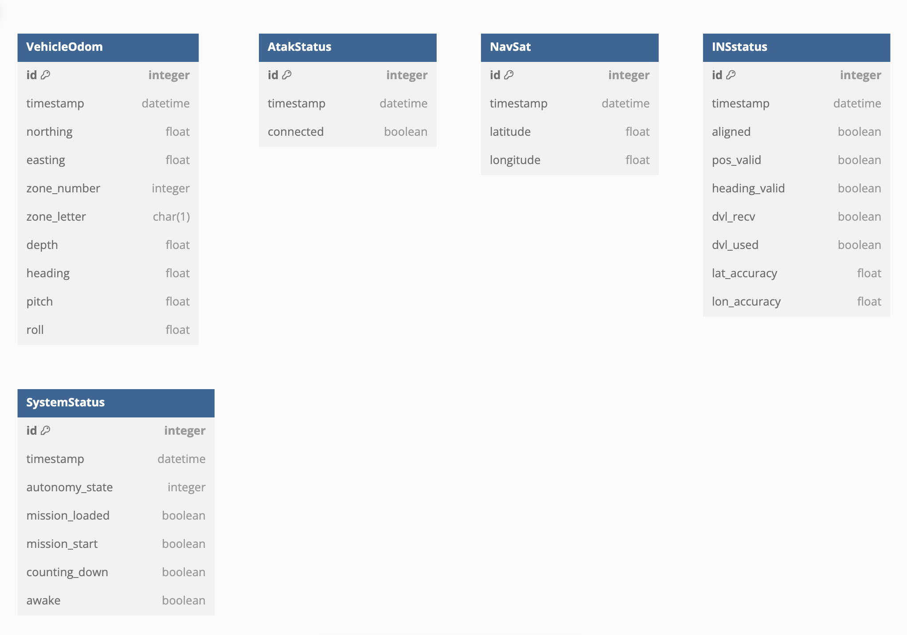

# Project Design Document

## Vessel Autonomy System Dashboard

---

Prepared by:

- `Connor Jason`, `VATN Systems`

---

**Date**: 2024-11-10

---

## Table of Contents

- [Project Design Document](#project-design-document)
  - [Vessel Autonomy System Dashboard](#vessel-autonomy-system-dashboard)
  - [Table of Contents](#table-of-contents)
    - [Document Revision History](#document-revision-history)
- [1. Introduction](#1-introduction)
- [2. Project Plan](#2-project-plan)
  - [2.1 Day 1 - Sprint 1: Planning and Documentation](#21-day-1---sprint-1-planning-and-documentation)
  - [2.2 Day 2 - Sprint 2: Component Development](#22-day-2---sprint-2-component-development)
  - [2.3 Day 3 - Sprint 3: Integration and Testing](#23-day-3---sprint-3-integration-and-testing)
- [3. Component-level Design](#3-component-level-design)
  - [3.1 Model](#31-model)
  - [3.2 Controller](#32-controller)
  - [3.3 View and User Interface Design](#33-view-and-user-interface-design)
- [4. GitHub Issues](#4-github-issues)
- [5. References](#5-references)

### Document Revision History

| Name    | Date       | Changes                      | Version |
|---------|------------|------------------------------|---------|
| Initial | 2024-11-04 | Created initial project plan | 1.0     |

# 1. Introduction

This document outlines the design and implementation plan for the **Vessel Autonomy System Dashboard** project. The goal is to develop a React-based dashboard application that visualizes time-based data from a vessel's autonomy system. The application will display data in real-time, maintain state across page refreshes, and present information in a clear, intuitive, and visually appealing manner using Tailwind CSS and appropriate data visualizations.

# 2. Project Plan

The project will be completed over **three days**, with each day acting as a sprint focusing on specific tasks.

## 2.1 Day 1 - Sprint 1: Planning and Documentation

**Date**: 2024-11-05

### Objectives:

- Finalize project requirements and scope.
- Create detailed documentation, including user stories and design specifications.
- Set up the project repository and development environment.

### Tasks:

1. **Define User Stories**: Clearly outline all user stories to capture the requirements.
2. **Design Mockups**: Sketch the UI components and overall layout of the dashboard.
3. **Database Schema Design**: If applicable, design the database schema for data persistence.
4. **Prepare Project Documentation**: Compile all documentation needed to begin the project.
5. **Set Up Repository**: Initialize a GitHub repository and configure project settings.
6. **Create GitHub Issues**: List all tasks as GitHub issues with titles, descriptions, and categories.

### Deliverables:

- Project Design Document (this document).
- Detailed user stories.
- UI mockups and design sketches.
- Database schema diagrams.
- GitHub repository with initial commit.
- GitHub issues for all tasks.

## 2.2 Day 2 - Sprint 2: Component Development

**Date**: 2024-11-06

### Objectives:

- Develop individual React components for each data state.
- Ensure components are modular and styled using Tailwind CSS.
- Implement state management to maintain state across page refreshes.

### Tasks:

1. **Set Up React Project**: Initialize the React project with Tailwind CSS integration.
2. **Implement State Management**: Use local storage or a state management library.
3. **Develop VehicleOdom Component**: Display heading, pitch, roll, and depth with visual indicators.
4. **Develop NavSat Component**: Display current latitude and longitude on an interactive map.
5. **Develop INSstatus Component**: Show INS status with appropriate indicators.
6. **Develop SystemStatus Component**: Display system autonomy state and mission statuses.
7. **Develop AtakStatus Component**: Indicate Atak system connection status.

### Deliverables:

- Completed React components for all data states.
- Styling applied using Tailwind CSS.
- State management implemented.
- Components tested individually.

## 2.3 Day 3 - Sprint 3: Integration and Testing

**Date**: 2024-11-07

### Objectives:

- Integrate all components into the main application.
- Implement data visualizations using charts and graphs.
- Test the application thoroughly and optimize performance.
- Finalize documentation and prepare for deployment.

### Tasks:

1. **Integrate Components**: Assemble all components within the main dashboard layout.
2. **Implement Data Visualizations**: Use libraries like Chart.js or Recharts.
3. **Ensure Responsiveness**: Make the dashboard responsive across devices.
4. **Optimize Performance**: Ensure components are lightweight and efficient.
5. **Conduct Testing**: Write and run unit tests for all components.
6. **Update Documentation**: Revise and finalize the project documentation.
7. **Prepare for Deployment**: Ensure the application is ready for deployment.

### Deliverables:

- Fully integrated dashboard application.
- Data visualizations implemented.
- Application tested and optimized.
- Updated project documentation.
- Ready-to-deploy application package.

# 3. Component-level Design

### 3.1 Model

The application primarily uses React state and potentially local storage for maintaining state across page refreshes. If a backend database is required, the following models represent the data structures:

#### Data Models:

### 3.2 Controller

As this is a React application, the controller logic is managed through React components and state management. The data will be updated at specified intervals (e.g., using `setInterval` in `useEffect` hooks) to simulate real-time updates.

**Data Update Rates:**

- `VehicleOdom`: 5 Hz
- `AtakStatus`: 1 Hz
- `NavSat`: 5 Hz
- `INSstatus`: 1 Hz
- `SystemStatus`: 2 Hz

### 3.3 View and User Interface Design

We will use **Tailwind CSS** for styling and ensure the UI is intuitive and visually appealing. Data visualizations such as graphs, charts, and gauges will be implemented using libraries like **Chart.js** or **Recharts**.

#### UI Components:

1. **VehicleOdom Card**

   - Displays heading, pitch, roll, and depth.
   - Uses gauges or indicators for visual representation.

2. **NavSat Card**

   - Shows current latitude and longitude on an interactive map.
   - Map integration using libraries like **Leaflet** or **Google Maps API**.

3. **INSstatus Card**

   - Displays INS status with indicators (aligned, position valid, etc.).
   - Uses icons or color codes to represent status.

4. **SystemStatus Card**

   - Shows autonomy state and mission statuses.
   - Uses descriptive text and status indicators.

5. **AtakStatus Card**

   - Indicates Atak system connection status.
   - Uses green/red icons or text to show connection status.

#### User Stories and Interfaces:

- **US1**: NavSat component addresses the need to view the vessel's current position.
- **US2**: VehicleOdom component allows operators to see orientation and depth.
- **US3**: SystemStatus component provides system autonomy and mission status.
- **US4**: INSstatus component helps monitor INS status.
- **US5**: AtakStatus component shows connection status.
- **US6 & US7**: Application maintains state and updates data automatically.
- **US8**: Data presented with clear visuals using charts and graphs.

# 4. GitHub Issues

Below is a list of GitHub issues to be created for project management:

1. **Implement State Management**

   - **Description**: Implement state persistence using local storage or a state management library.
   - **Category**: `state-management`

2. **Develop VehicleOdom Component**

   - **Description**: Create a component to display heading, pitch, roll, and depth with visual indicators. Update at 5 Hz.
   - **Category**: `frontend`, `component`

3. **Develop NavSat Component**

   - **Description**: Create a component to display current latitude and longitude on an interactive map. Update at 5 Hz.
   - **Category**: `frontend`, `component`

4. **Develop INSstatus Component**

   - **Description**: Create a component to display INS status with appropriate indicators. Update at 1 Hz.
   - **Category**: `frontend`, `component`

5. **Develop SystemStatus Component**

   - **Description**: Create a component to display system autonomy state and mission statuses. Update at 2 Hz.
   - **Category**: `frontend`, `component`

6. **Develop AtakStatus Component**

   - **Description**: Create a component to display Atak system connection status. Update at 1 Hz.
   - **Category**: `frontend`, `component`

7. **Integrate Components into Dashboard**

   - **Description**: Assemble all components into the main dashboard layout.
   - **Category**: `frontend`, `integration`

8. **Implement Data Visualizations**

   - **Description**: Use data visualization libraries to present data with charts, graphs, and gauges.
   - **Category**: `frontend`

9. **Ensure Responsive Design**

    - **Description**: Make the dashboard responsive and mobile-friendly.
    - **Category**: `frontend`

10. **Optimize Performance**

    - **Description**: Optimize components for efficiency and lightweight operation.
    - **Category**: `performance`

11. **Write Unit Tests**

    - **Description**: Write unit tests for each component to ensure reliability.
    - **Category**: `testing`

12. **Update Documentation**

    - **Description**: Document code and update project documentation.
    - **Category**: `documentation`

14. **Implement Map Integration in NavSat Component**

    - **Description**: Integrate a map library to display vessel position.
    - **Category**: `frontend`, `enhancement`

15. **Design Compass Graphic in VehicleOdom Component**

    - **Description**: Create a compass graphic to represent the vessel's heading.
    - **Category**: `frontend`, `enhancement`

16. **Conduct End-to-End Testing**

    - **Description**: Perform comprehensive testing of the entire application.
    - **Category**: `testing`

# 5. References
